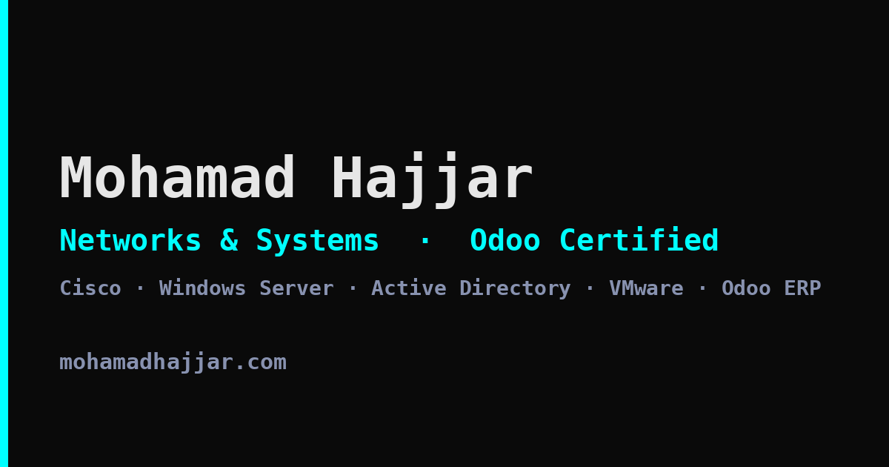

# Portfolio — [mohhajjar.com](https://mohhajjar.com)

Personal portfolio site for Moh Hajjar — networks, systems and Odoo ERP work.



## About

A single-page static site with no build step, no framework and no dependencies to install.
Written by hand in HTML, CSS and vanilla JavaScript, and deployed straight from `main`
to GitHub Pages.

**Sections:** Hero · About · Experience & Education · Projects · Contact

## Stack

| | |
|---|---|
| Markup | Semantic HTML5 |
| Styling | CSS custom properties, Grid and Flexbox — one stylesheet, no preprocessor |
| Behaviour | Vanilla JavaScript in an IIFE — no libraries |
| Icons | Inline SVG sprite |
| Type | Open Sans via Google Fonts |
| Hosting | GitHub Pages, custom domain via `CNAME` |

## Structure

```
index.html            markup, SVG icon sprite, project detail dialogs
css/style.css         design tokens, layout, components, breakpoints
js/main.js            smooth scroll, scroll-spy, mobile nav, modals
img/                  profile picture (JPEG + WebP), icons, share card
assets/               CV (PDF)
robots.txt            crawler directives
sitemap.xml           single-URL sitemap
CNAME                 custom domain for GitHub Pages
```

## Notes

A few things the site does deliberately:

- **Lightweight by design** — roughly 97 KB transferred on first load, from two origins.
  Icons are an inline SVG sprite rather than an icon font, and the profile picture is served
  as WebP with a JPEG fallback through `<picture>`.
- **Accessible** — semantic landmarks and headings, a keyboard-operable mobile nav that is
  removed from the tab order when closed, native `<dialog>` for project detail (so Escape,
  focus trapping and backdrop dismissal come for free), and a focus ring scoped to
  `:focus-visible` so it appears for keyboard users and not on mouse clicks.
- **Responsive** — a single fluid layout from 320 px upwards, with the navigation collapsing
  to a slide-in panel at 768 px.
- **Reduced motion** — smooth scrolling and transitions are disabled under
  `prefers-reduced-motion: reduce`.
- **Discoverable** — Open Graph and Twitter Card tags with a generated share image, a
  canonical URL, and `Person` JSON-LD structured data.

## Running it locally

No dependencies. Serve the directory with anything, for example:

```bash
python3 -m http.server 5500
```

Then open <http://127.0.0.1:5500>.

Opening `index.html` directly over `file://` works too, though a local server matches
production more closely.

## Related repositories

- [enterprise-network-design](https://github.com/moh-hajj/enterprise-network-design) — three-site, 76-user enterprise network design and implementation
- [windows-server-ad-lab](https://github.com/moh-hajj/windows-server-ad-lab) — multi-DC Active Directory, backup, VPN and Server Core lab

## Licence

Code is free to reference. Content, images and CV are © Moh Hajjar — please don't reuse
them as your own.
